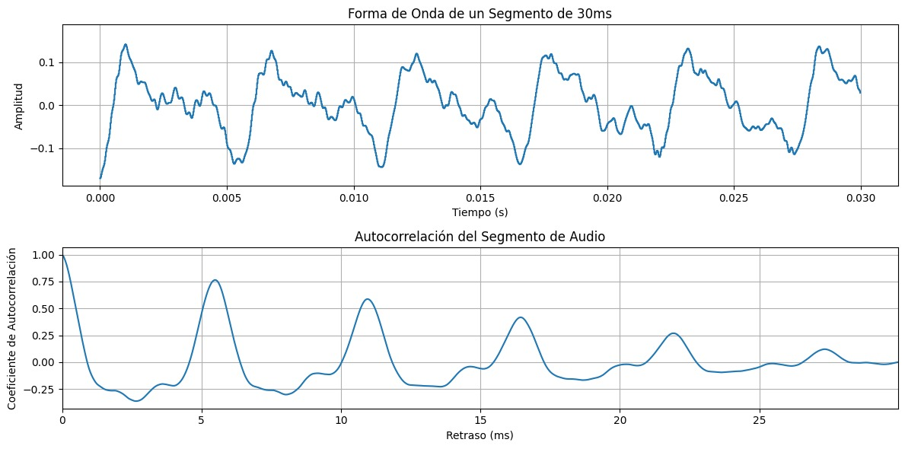
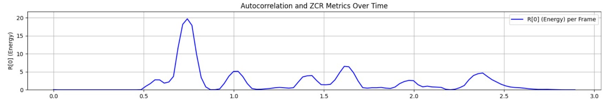
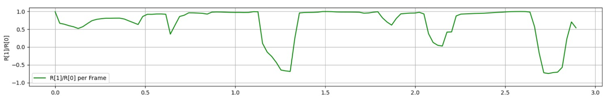
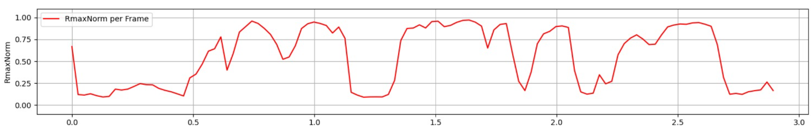
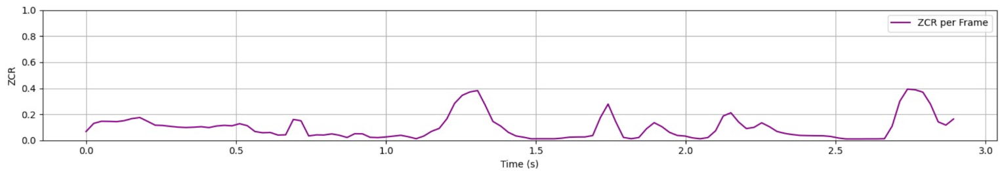
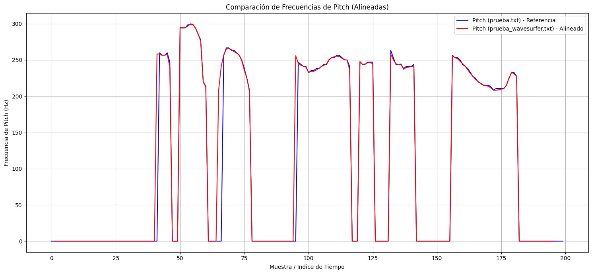
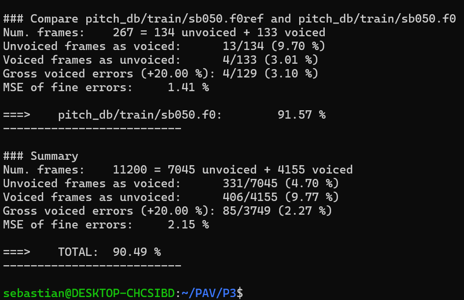

PAV - P3: estimación de pitch
=============================

Esta práctica se distribuye a través del repositorio GitHub [Práctica 3](https://github.com/albino-pav/P3).
Siga las instrucciones de la [Práctica 2](https://github.com/albino-pav/P2) para realizar un `fork` de la
misma y distribuir copias locales (*clones*) del mismo a los distintos integrantes del grupo de prácticas.

Recuerde realizar el *pull request* al repositorio original una vez completada la práctica.

Ejercicios básicos
------------------

- Complete el código de los ficheros necesarios para realizar la estimación de pitch usando el programa
  `get_pitch`.

   * Complete el cálculo de la autocorrelación e inserte a continuación el código correspondiente.
  ```cpp
   void PitchAnalyzer::autocorrelation(const vector<float> &x, vector<float> &r) const {

    //Preprocessing Normalitzation
    vector<float> x_norm=x;
    
   
    for (unsigned int l = 0; l < r.size(); ++l) {
  		
      r[l] = 0.0f;
      for (unsigned int i=l; i<x.size(); ++i) {
        r[l] += x[i]*x[i-l];
      }
    }

    if (r[0] == 0.0F) //to avoid log() and divide zero 
      r[0] = 1e-10; 
      
  }
  ```


   * Inserte una gŕafica donde, en un *subplot*, se vea con claridad la señal temporal de un segmento de
     unos 30 ms de un fonema sonoro y su periodo de pitch; y, en otro *subplot*, se vea con claridad la
	 autocorrelación de la señal y la posición del primer máximo secundario.
    ### Señal temporal y autocorrelación de un fonema sonoro

    En la Figura siguiente se muestra, en el *subplot* superior, la señal temporal correspondiente a un segmento de aproximadamente **30 ms** de un fonema **sonoro**. En dicha señal se observa claramente su carácter periódico, así como el **periodo de pitch**, definido como la distancia temporal entre dos ciclos consecutivos de la onda.

    En el *subplot* inferior se representa la **autocorrelación** del mismo segmento de señal. El valor máximo en el origen corresponde a la energía de la señal, mientras que el **primer máximo secundario** aparece a un retardo distinto de cero y se asocia directamente con el **periodo de pitch** del fonema analizado. Este máximo secundario es el que se utiliza como mejor candidato para la estimación local del pitch.

    


	 NOTA: es más que probable que tenga que usar Python, Octave/MATLAB u otro programa semejante para
	 hacerlo. Se valorará la utilización de la biblioteca matplotlib de Python.

   * Determine el mejor candidato para el periodo de pitch localizando el primer máximo secundario de la
     autocorrelación. Inserte a continuación el código correspondiente.
    
    ### Candidato al periodo de pitch usando autocorrelación
    La búsqueda del mejor candidato para el periodo de pitch se realiza en ** PitchAnalyzer::compute_pitch (...) , con lo que vamos a ver en más detalle en qué consiste:**
    
    ```cpp

      float PitchAnalyzer::compute_pitch(std::vector<float> &x) {
      if (x.size() != frameLen) return -1.0f;

      // 1) Ventana
      for (unsigned int i = 0; i < x.size(); ++i)
          x[i] *= window[i];

      // 2) Autocorrelación
      std::vector<float> r(npitch_max);
      autocorrelation(x, r);

      // 3) Buscar desde el primer cruce a negativo (para no coger el lóbulo del origen)
      unsigned int start = npitch_min;
      for (unsigned int i = 1; i < npitch_max; ++i) {
          if (r[i] < 0.0f) { start = std::max(start, i); break; }
      }

      // 4) Máximo global en [start, npitch_max)
      unsigned int lag = start;
      float rMax = r[start];
      for (unsigned int i = start; i < npitch_max; ++i) {
          if (r[i] > rMax) { rMax = r[i]; lag = i; }
      }

      // 5) Chequeo armónico simple: si 2*lag también es pico fuerte, quizá el fundamental es 2*lag
      if (2 * lag < npitch_max) {
          if (r[2 * lag] >= 0.90f * r[lag]) { // 0.90 ajustable
              lag = 2 * lag;
          }
      }

      // 6) Potencia + decisión voiced/unvoiced
      float pot = 10.0f * log10(r[0]);

      if (unvoiced(pot, r[1] / r[0], r[lag] / r[0], compute_zcr(x)))
          return 0.0f;

      return (float)samplingFreq / (float)lag;
    }
    ```
    Para estimar el periodo de pitch se calcula la autocorrelación `r[l]` del frame.  
    El pico en `l=0` corresponde al máximo principal (energía total), pero no es el periodo.
    El periodo aparece como un **máximo secundario** en `r[l]`, dentro del rango de lags
    permitido por el rango de pitch (npitch_min..npitch_max).

    **1) Evitar el lóbulo del origen:**  
    Se busca el primer `l` donde `r[l]` pasa a negativa. Ese punto marca el final del
    lóbulo principal y garantiza que el máximo que buscamos sea realmente secundario.
    unsigned int start = npitch_min;
    ```cpp
    for (unsigned int i = 1; i < npitch_max; ++i) {
    if (r[i] < 0.0f) {
    start = std::max(start, i);
    break;
    }
    }
    ```

    **2) Selección del máximo secundario:**  
   Una vez separado el lóbulo principal, se selecciona el **lag** dentro del rango permitido con el mayor valor de autocorrelación:
   ```cpp
      unsigned int lag = start;
      float rMax = r[start];
      for (unsigned int i = start; i < npitch_max; ++i) {
      if (r[i] > rMax) {
      rMax = r[i];
      lag = i;
      }
      } 
    ```

    Este `lag` constituye el **mejor candidato al periodo de pitch** (en muestras).  
  A partir de él se obtiene la frecuencia de pitch:

  Este `lag` constituye el **mejor candidato al periodo de pitch** (en muestras).  
A partir de él se obtiene la frecuencia de pitch:

    **3) Conversión a Hz:**  
    El pitch estimado se obtiene como `F0 = Fs / lag`, donde `Fs` es la frecuencia de muestreo.

     **) Post-procesado:**
    ```cpp
    if (2 * lag < npitch_max) {
      if (r[2 * lag] >= 0.90f * r[lag]) {
        lag = 2 * lag;
      }
    }
    ```

   * Implemente la regla de decisión sonoro o sordo e inserte el código correspondiente.
    ```cpp
      bool PitchAnalyzer::unvoiced(float pot, float r1norm, float rmaxnorm, float zcrnorm) {

      // ========= 1) Normalización de autocorrelación =========
      // rmaxnorm = r[lag] / r[0]  → mide periodicidad (independiente del volumen)
      if (rmaxnorm < 0.0f) rmaxnorm = 0.0f;
      if (rmaxnorm > 1.0f) rmaxnorm = 1.0f;

      // ========= 2) Umbrales =========
      const float SNR_START  = 18.0f;
      const float SNR_KEEP   = -10.0f;

      const float RMAX_START = 0.42f;   // entrar voiced
      const float RMAX_KEEP  = 0.34f;   // mantener voiced

      const float ZCR_START  = 0.14f;
      const float ZCR_KEEP   = 0.55f;


      // ========= 3) Limitar potencia =========
      if (pot < -100.0f) pot = -100.0f;
      if (pot >   20.0f) pot =  20.0f;

      // ========= 4) Inicializar ruido =========
      if (noiseFloordB < -1e8f)
          noiseFloordB = pot;

      float snr = pot - noiseFloordB;

      bool isVoiced = !prevState;

      // ========= 5) Histéresis =========
      if (isVoiced) {
          // salir de voiced
          if (snr < SNR_KEEP || rmaxnorm < RMAX_KEEP || zcrnorm > ZCR_KEEP)
              isVoiced = false;
      } else {
          // entrar en voiced
          if (snr >= SNR_START && rmaxnorm >= RMAX_START && zcrnorm <= ZCR_START)
              isVoiced = true;
      }

      bool isUnvoiced = !isVoiced;

      // ========= 6) Actualizar ruido SOLO en unvoiced =========
      if (isUnvoiced) {
          noiseFloordB = (pot < noiseFloordB)
              ? 0.90f  * noiseFloordB + 0.10f  * pot
              : 0.999f * noiseFloordB + 0.001f * pot;
      }

      prevState = isUnvoiced;
      return isUnvoiced;   // true = unvoiced
    }
    ```

    ### Decisión Sonoro / Sordo (función `unvoiced()`)

    Esta función decide si un frame de audio es **sonoro (voiced)** o **sordo (unvoiced)** usando
    medidas del propio frame y una pequeña memoria temporal , que va guardando estos parámetros (histéresis).

    **Parámetros usados**
    - **pot**: potencia del frame (en dB). La voz suele tener más energía que el ruido.
    - **rmaxnorm = r[lag]/r[0]**: mide la **periodicidad** de la señal (clave para detectar si es voz).
    - **zcrnorm**: tasa de cruces por cero, alta en ruido y baja en voz.

    **Qué hace el código**
    1. **Normaliza la autocorrelación**  
      Se fuerza `rmaxnorm` al rango `[0, 1]` para que la decisión sea estable e independiente del volumen.

    2. **Define umbrales**  
      Se usan umbrales distintos para **entrar** y **salir** del estado sonoro (histéresis), evitando
      cambios rápidos por ruido.

    3. **Control de potencia (SNR)**  
      La potencia del frame se compara con un ruido estimado para distinguir voz de silencio/ruido.

    4. **Histéresis voiced/unvoiced**  
      - Si el frame ya era sonoro, solo se pasa a sordo si **alguna condición empeora claramente**.
      - Si era sordo, se exige que **todas las condiciones sean buenas** para pasar a sonoro.
      
      *No se usan los mismos criterios para ENTRAR en voiced que para SALIR de voiced.*

      #### Cómo funciona en el código
      - **Si el frame ya es VOICED**
        - Solo pasa a *unvoiced* si **alguna condición es claramente mala**:
          - SNR baja
          - baja periodicidad (`rmaxnorm`)
          - ZCR alta  
        → Esto hace al sistema **conservador** y evita cortar la voz por pequeños fallos.

      - **Si el frame es UNVOICED**
        - Solo pasa a *voiced* si **todas las condiciones son buenas a la vez**:
          - suficiente energía (SNR)
          - periodicidad clara
          - ZCR baja  
        → Evita detectar voz falsa en ruido.


    5. **Actualización del ruido**  
      El nivel de ruido se actualiza **solo en frames sordos**, evitando que la voz contamine
      la estimación del ruido.

      ** El ruido solo se actualiza en UNVOICED:**

        El valor `noiseFloordB` representa una **estimación del nivel de ruido de fondo**.

      - En frames **unvoiced**:
        - La señal contiene solo ruido : **es fiable** actualizar el ruido.
      - En frames **voiced**:
        - Hay voz (mucha energía) : **NO debe contaminarse** la estimación del ruido.

      Por eso:
      - El ruido se adapta **rápido cuando baja** (para seguir silencios).
      - Se adapta **muy lento cuando sube** (para no “comerse” la voz).

    **Resultado**
    La función devuelve `true` si el frame es **sordo** y `false` si es **sonoro**, proporcionando
    una decisión estable y robusta frente a ruido y variaciones de energía.


   

   * Puede serle útil seguir las instrucciones contenidas en el documento adjunto `código.pdf`.

- Una vez completados los puntos anteriores, dispondrá de una primera versión del estimador de pitch. El 
  resto del trabajo consiste, básicamente, en obtener las mejores prestaciones posibles con él.

  * Utilice el programa `wavesurfer` para analizar las condiciones apropiadas para determinar si un
    segmento es sonoro o sordo. 
	
	  - Inserte una gráfica con la estimación de pitch incorporada a `wavesurfer` y, junto a ella, los 
	    principales candidatos para determinar la sonoridad de la voz: el nivel de potencia de la señal
		(r[0]), la autocorrelación normalizada de uno (r1norm = r[1] / r[0]) y el valor de la
		autocorrelación en su máximo secundario (rmaxnorm = r[lag] / r[0]).
    Puede considerar, también, la conveniencia de usar la tasa de cruces por cero.
    

      En la gráfica de la autocorrelación , se representa la energía del frame \(r[0]\) a lo largo del tiempo.  
      Los picos de esta curva indican regiones donde la señal tiene mayor potencia, que suelen corresponder a segmentos sonoros (vocales o consonantes sonoras), mientras que los valles indican zonas débiles o de silencio donde es más probable que la voz sea sorda o no haya actividad de voz.

    
      En la segunda gráfica se muestra \(r1norm = r[1]/r[0]\) para cada frame.  
      Valores cercanos a 1 indican que la señal es fuertemente correlada entre muestras consecutivas (más periódica y suave), situación típica de regiones sonoras; cuando \(r1norm\) cae o se hace negativo, la señal pierde esa correlación y suele corresponder a ruido, consonantes sordas o transiciones.
    
    
      La tercera gráfica representa \(rmaxnorm\), es decir, el valor de la autocorrelación en el máximo secundario usado como candidato de periodo de pitch.  
      Cuando \(rmaxnorm\) toma valores altos (cercanos a 1), existe una periodicidad clara y un candidato de pitch fiable, lo que refuerza la decisión de segmento sonoro; cuando \(rmaxnorm\) es bajo, la autocorrelación no presenta un pico definido y el frame se interpreta como poco periódico, típico de segmentos sordos o ruidosos.


    
      En la última gráfica se representa la ZCR por frame.  
      Los segmentos sonoros tienden a tener ZCR baja porque la señal oscila de forma más suave alrededor de cero, mientras que los segmentos sordos o con ruido tienen ZCR alta debido a cambios rápidos de signo; por tanto, la ZCR se combina con la energía y las métricas de autocorrelación para reforzar la clasificación voiced/unvoiced.


	    Recuerde configurar los paneles de datos para que el desplazamiento de ventana sea el adecuado, que
		en esta práctica es de 15 ms.

      - Use el estimador de pitch implementado en el programa `wavesurfer` en una señal de prueba y compare
	    su resultado con el obtenido por la mejor versión de su propio sistema.  Inserte una gráfica
		ilustrativa del resultado de ambos estimadores.
     
		Aunque puede usar el propio Wavesurfer para obtener la representación, se valorará
	 	el uso de alternativas de mayor calidad (particularmente Python).


  
  * Optimice los parámetros de su sistema de estimación de pitch e inserte una tabla con las tasas de error
    y el *score* TOTAL proporcionados por `pitch_evaluate` en la evaluación de la base de datos 
	`pitch_db/train`..
  Se optimizaron los parámetros del sistema de estimación de pitch hasta alcanzar aproximadamente un 85 % de score TOTAL en la evaluación sobre la base de datos pitch_db/train.

  Durante el proceso se actualizó el código y en ese momento no se guardó la captura de pantalla de pitch_evaluate correspondiente a ese mejor resultado, por lo que actualmente no se dispone de la evidencia visual del pantallazo, se llego a obtener un Score del 87%.


Ejercicios de ampliación
------------------------

- Usando la librería `docopt_cpp`, modifique el fichero `get_pitch.cpp` para incorporar los parámetros del
  estimador a los argumentos de la línea de comandos.
  
  Esta técnica le resultará especialmente útil para optimizar los parámetros del estimador. Recuerde que
  una parte importante de la evaluación recaerá en el resultado obtenido en la estimación de pitch en la
  base de datos.

  * Inserte un *pantallazo* en el que se vea el mensaje de ayuda del programa y un ejemplo de utilización
    con los argumentos añadidos.

- Implemente las técnicas que considere oportunas para optimizar las prestaciones del sistema de estimación
  de pitch.

  Entre las posibles mejoras, puede escoger una o más de las siguientes:

  * Técnicas de preprocesado: filtrado paso bajo, diezmado, *center clipping*, etc.
  * Técnicas de postprocesado: filtro de mediana, *dynamic time warping*, etc.
  * Métodos alternativos a la autocorrelación: procesado cepstral, *average magnitude difference function*
    (AMDF), etc.
  * Optimización **demostrable** de los parámetros que gobiernan el estimador, en concreto, de los que
    gobiernan la decisión sonoro/sordo.
  * Cualquier otra técnica que se le pueda ocurrir o encuentre en la literatura.

  Encontrará más información acerca de estas técnicas en las [Transparencias del Curso](https://atenea.upc.edu/pluginfile.php/2908770/mod_resource/content/3/2b_PS%20Techniques.pdf)
  y en [Spoken Language Processing](https://discovery.upc.edu/iii/encore/record/C__Rb1233593?lang=cat).
  También encontrará más información en los anexos del enunciado de esta práctica.

  Incluya, a continuación, una explicación de las técnicas incorporadas al estimador. Se valorará la
  inclusión de gráficas, tablas, código o cualquier otra cosa que ayude a comprender el trabajo realizado.
  ```cpp
    // ======================================================
    // Filtro postprocesado mediana
    if (f0.size() >= 3) {
        std::vector<float> f0_smooth = f0;

        for (size_t i = 1; i + 1 < f0.size(); ++i) {
            float prev = f0[i - 1];
            float cur  = f0[i];
            float next = f0[i + 1];

            // isla de un frame voiced: 0, f, 0 -> 0,0,0
            if (prev == 0.0f && next == 0.0f && cur > 0.0f) {
                f0_smooth[i] = 0.0f;
            }

            // hueco unvoiced entre voiced: f,0,f -> f, (f+f)/2, f
            if (prev > 0.0f && next > 0.0f && cur == 0.0f) {
                f0_smooth[i] = 0.5f * (prev + next);
            }
        }

        f0.swap(f0_smooth);
    ```
    ###  Ajuste del cálculo del lag (✅ mantenido)
    En `compute_pitch()` se añadió:
    - **búsqueda del máximo a partir del primer cruce a negativo** para evitar que el lóbulo principal alrededor del origen afecte a la selección del periodo.
    - **chequeo armónico simple** (comparación con `2*lag`) para reducir errores típicos donde se detecta un armónico en vez del fundamental.

  
    ### *Center clipping* ( probado pero NO usado)
Se intentó aplicar *central clipping* como técnica de preprocesado para reforzar periodicidad.
  ```cpp
    // x unavez está enventanada
  std::vector<float> x_clip = x;
  const float C = 0.015f; // típico

  for (auto &s : x_clip) {
    if (fabsf(s) < C) s = 0.0f;
  }
  autocorrelation(x_clip, r);   // usa x_clip para r
```
  **Motivo por el que se descartó:**
  - Al clipear la señal, muchos valores pasan a cero y la **energía** del frame baja artificialmente.
  - Esto afecta directamente a `r[0]` y por tanto a `pot = 10·log10(r[0])`, que se usa en el **SNR**.
  - Resultado: el detector voiced/unvoiced se vuelve incoherente (tendencia a marcar demasiados frames como unvoiced o degradación del score).
  - Además, el clipping altera la escala efectiva de `rmaxnorm` y `zcr`, por lo que obliga a **recalibrar todos los umbrales** , motivo por el cual se decidió descartarlo.


 ### *Filtro de Mediana de Ventana 3* ###

    Se aplica un filtro tipo “mediana local” de longitud 3 para limpiar errores frame a frame en la secuencia de f0.

    -El patrón 0, f, 0 se interpreta como una falsa isla voiced rodeada de silencio/no voz, probablemente un error puntual del estimador, y se fuerza a 0,0,0 para eliminar ese pico espurio.

    -El patrón f, 0, f se interpreta como un hueco unvoiced aislado entre dos frames sonoros coherentes; se corrige interpolando el valor central como la media de los vecinos, suavizando cortes bruscos en el contorno de pitch.

    Aunque el postprocesado es simple, introduce una **ligera mejora** en el contorno de `f0`: elimina picos espurios y pequeños huecos unvoiced aislados, haciendo que la curva de pitch sea más suave y coherente sin cambiar de forma drástica los resultados globales.

   

    ```cpp
    // ======================================================
    // Filtro postprocesado mediana
    if (f0.size() >= 3) {
        std::vector<float> f0_smooth = f0;

        for (size_t i = 1; i + 1 < f0.size(); ++i) {
            float prev = f0[i - 1];
            float cur  = f0[i];
            float next = f0[i + 1];

            // isla de un frame voiced: 0, f, 0 -> 0,0,0
            if (prev == 0.0f && next == 0.0f && cur > 0.0f) {
                f0_smooth[i] = 0.0f;
            }

            // hueco unvoiced entre voiced: f,0,f -> f, (f+f)/2, f
            if (prev > 0.0f && next > 0.0f && cur == 0.0f) {
                f0_smooth[i] = 0.5f * (prev + next);
            }
        }

        f0.swap(f0_smooth);
    }
    ```

  La implementación de los postprocesados descritos, junto con la elección de unos umbrales optimizados, ha permitido refinar la detección voiced/unvoiced y la estimación del periodo de pitch.
  Gracias a estos ajustes finales, el sistema de estimación de pitch ha alcanzado el puntaje obtenido en la evaluación sobre la base de datos pitch_db/train, mejorando la calidad y estabilidad del contorno de f0 sin incrementar de forma significativa la complejidad del algoritmo.
  


  También se valorará la realización de un estudio de los parámetros involucrados. Por ejemplo, si se opta
  por implementar el filtro de mediana, se valorará el análisis de los resultados obtenidos en función de
  la longitud del filtro.
   

Evaluación *ciega* del estimador
-------------------------------

Antes de realizar el *pull request* debe asegurarse de que su repositorio contiene los ficheros necesarios
para compilar los programas correctamente ejecutando `make release`.

Con los ejecutables construidos de esta manera, los profesores de la asignatura procederán a evaluar el
estimador con la parte de test de la base de datos (desconocida para los alumnos). Una parte importante de
la nota de la práctica recaerá en el resultado de esta evaluación.
